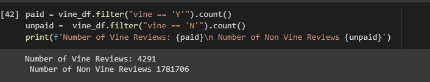
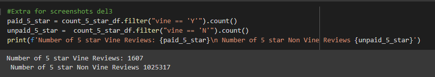
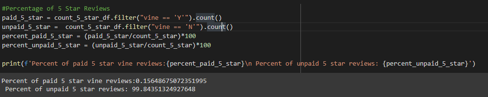

# Amazon_Vine_Analysis
 AWS, Spark, Postgresql

### Module 16 Amazon Vine Analysis
**Deliverable 1:** [Amazon_Reviews_ETL](Amazon_Reviews_ETL.ipynb)
**Deliverable 2:** [Vine_Reviews_Analysis](Vine_Reviews_Analysis.ipynb)

## Overview of Pewlett-Hackard-Analysis:
The purpose of this analysis is to pick a dataset, use PySpark to perform the ETL process and connect to the AWS RDS instance and then load and transform the data into the pgadmin database.

## Results:

- Number of Vine and Non Vine Reviews

- Number of 5 star Vine and Non Vine Reviews

- Percent of 5 star Vine and Non Vine Reviews

## Summary:
approximately 57.55% of non vine users out of 1,781,706 users gave a 5 star review and approximately 37.45 of vine users out of 4291 users put a 5 star review.
Thus it can be concluded that there is no positive bias for vine users. Another analysis that can be done to support this statement would be to take a closer look at the verified purchases and their relation to vine and non vine users. 

